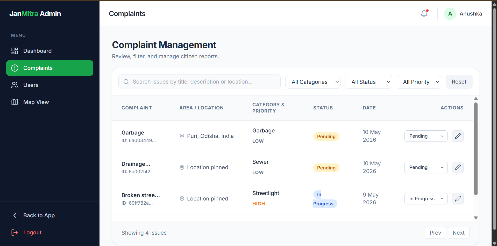
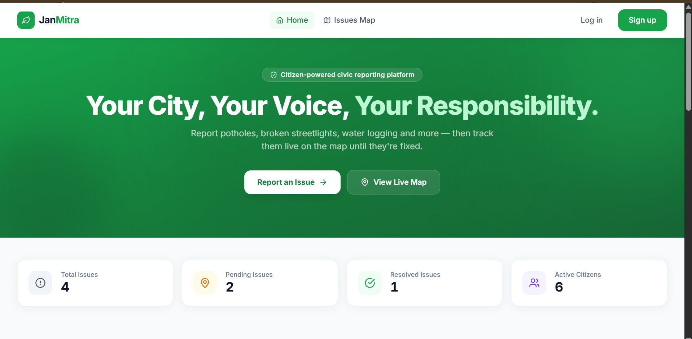
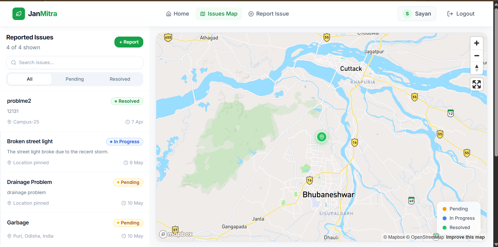
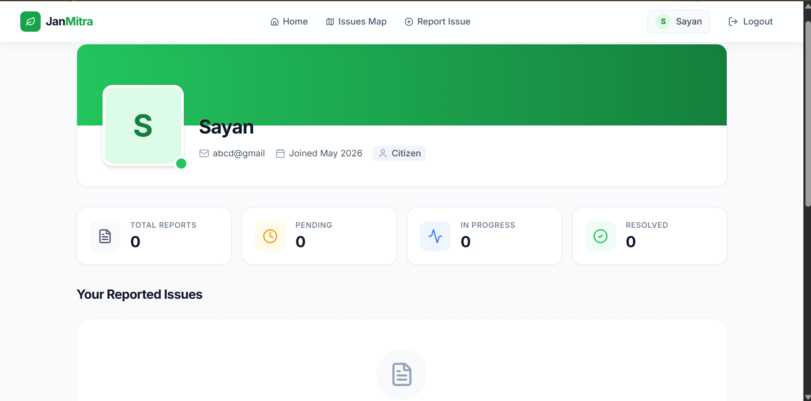

# 🏛️ JanMitra

> **Citizen-powered civic issue reporting platform.**

🏆 **Ranked 6th out of 520 teams at Smart India Hackathon 2025 (Internal Round)**

---

Check it out here: https://jan-mitra-three.vercel.app/

## 📖 Project Overview

JanMitra is a modern, full-stack civic-tech platform designed to empower citizens to report local infrastructure and civic issues such as potholes, broken streetlights, garbage overflow, water leakage, and drainage problems. By bridging the gap between citizens and local authorities, JanMitra ensures better community engagement, transparency, and faster resolution of public problems. 

Citizens can seamlessly report issues, track live statuses on an interactive Mapbox-powered map, and monitor their contributions. Meanwhile, administrators manage and resolve complaints through a secure, high-performance dashboard.

---

## ✨ Features

- **User Authentication:** Secure JWT-based registration and login system.
- **Role-Based Access Control:** Distinct experiences for `Citizen` and `Admin` roles.
- **Report Civic Issues:** Easy-to-use forms for citizens to report issues with image uploads.
- **Interactive Map Integration:** Pinpoint exact issue locations powered by Mapbox.
- **Live Issue Tracking:** Filter, view, and track the real-time status of reported issues.
- **Location Autocomplete & Preview:** Inline map previews and geocoding during reporting.
- **Admin Dashboard:** Centralized complaint and user management interface.
- **Status Tracking:** Modern status pills (Pending, In Progress, Resolved, Rejected).
- **Modern SaaS Aesthetics:** Clean, highly responsive UI utilizing Tailwind CSS, Lucide icons, and micro-animations.

---

## 🛠️ Tech Stack

**Frontend**
- React.js (Vite)
- Tailwind CSS (Styling & Animations)
- React Router (Routing)
- Mapbox / react-map-gl (Maps)
- Lucide React (Icons)
- Context API (State Management)

**Backend**
- Node.js
- Express.js
- MongoDB (Database via Mongoose)
- JSON Web Tokens (Authentication)
- Cloudinary & Multer (Image Uploads)

---

## 📸 Screenshots

### 1. Admin Dashboard


### 2. Landing Page


### 3. Interactive Issues Map


### 4. Citizen Profile


---

## 🏗️ Folder Structure

The project follows a standard MERN Monorepo architecture to ensure strict separation of concerns:

```text
janmitra/
├── client/                     # React Frontend
│   ├── public/                 # Static assets
│   ├── src/
│   │   ├── assets/             # Images, icons, etc.
│   │   ├── components/         # Reusable UI components (Navbar, Footer, etc.)
│   │   ├── context/            # React Context (AuthContext)
│   │   ├── layouts/            # Page layouts (AdminLayout)
│   │   ├── pages/              # Application views (Home, ReportIssue, Profile, etc.)
│   │   └── services/           # Axios API configuration
│   └── package.json            # Client dependencies
│
├── server/                     # Node.js + Express Backend
│   ├── config/                 # Cloudinary & database configurations
│   ├── controllers/            # Route logic (users, issues, auth, maps)
│   ├── middleware/             # JWT authentication & admin validation
│   ├── models/                 # Mongoose schemas (User, Issue)
│   ├── routes/                 # Express API routes
│   └── server.js               # Backend entry point
│
└── package.json                # Root Monorepo configuration (concurrently)
```

---

## ⚙️ Installation & Setup

Follow these steps to get JanMitra running locally on your machine.

### 1. Clone the repository
```bash
git clone https://github.com/Anushka-230/Janmitra.git
cd Janmitra
```

### 2. Install dependencies
From the root directory, run the automated installation script to install dependencies for both the frontend and backend simultaneously:
```bash
npm run install:all
```
*(Alternatively, you can manually `cd client && npm install` and `cd server && npm install`)*

---

## 🔐 Environment Variables

You need to create `.env` files in both the `client` and `server` directories.

### Backend (`server/.env`)
Create a `.env` file in the `server/` directory:
```env
PORT=8080
MONGODB_URI=your_mongodb_connection_string
JWT_SECRET=your_super_secret_jwt_key
CLOUD_NAME=your_cloudinary_cloud_name
CLOUD_API_KEY=your_cloudinary_api_key
CLOUD_API_SECRET=your_cloudinary_api_secret
MAPBOX_TOKEN=your_mapbox_access_token
```

### Frontend (`client/.env`)
Create a `.env` file in the `client/` directory:
```env
VITE_API_URL=http://localhost:8080/api
VITE_MAPBOX_TOKEN=your_mapbox_access_token
```

---

## 🚀 Running the Project

Because the project is structured as a monorepo, you can start both the React frontend and Express backend concurrently from the root directory:

```bash
npm run dev
```

- The **Client** will run on `http://localhost:5173`
- The **Server** will run on `http://localhost:8080`

---

## 🛡️ Credentials 

To access the Admin Dashboard features, you will need an account with the `admin` role:

- **Email:** Anushka
- **Password:** abcd@123
- **Route:** `http://localhost:5173/admin/dashboard`

To access the Citizen Dashboard features, you will need an account with the `citizen` role:

- **Email:** Sayann
- **Password:** abcd@1234


---

## 📡 API Overview

The backend exposes a structured RESTful API.

- **Auth APIs** (`/api/auth`)
  - `POST /register` - Register a new user
  - `POST /login` - Authenticate and receive JWT
- **User APIs** (`/api/users`)
  - `GET /me` - Get logged-in citizen profile
  - `GET /me/issues` - Get issues reported by logged-in citizen
  - `GET /` - (Admin) Get all users
  - `PATCH /:id/role` - (Admin) Update user role
- **Issue APIs** (`/api/issues`)
  - `GET /` - Fetch all issues (with frontend filtering)
  - `POST /` - Report a new issue (supports Multer image upload)
  - `PATCH /:id/status` - (Admin) Update the status of an issue
- **Map APIs** (`/api/maps`)
  - `GET /forward` - Forward geocoding (address to coordinates)
  - `GET /reverse` - Reverse geocoding (coordinates to address)

---

## 👥 User Roles & Key Functionalities

### 🧑‍💼 Citizen (Default)
- Register and Log In.
- View public issues on the interactive map.
- Report a new issue (Title, Category, Priority, Location Map Pin, Image Upload).
- View their dedicated profile page to track their specific reported issues.

### 🏛️ Administrator
- Access the secure Admin Dashboard.
- View system-wide statistics (Total Users, Total Issues, Pending/Resolved counts).
- Manage Issues: Update status (Pending ➡️ In Progress ➡️ Resolved), edit details, or delete spam.
- Manage Users: View all registered citizens, promote to Admin, or delete accounts.

---

## 🔮 Future Improvements

- [ ] **Email/SMS Notifications:** Notify citizens automatically when their issue status changes.
- [ ] **Upvote System:** Allow citizens to upvote existing issues to increase priority.
- [ ] **AI-Based Categorization:** Use Machine Learning to auto-detect categories based on uploaded images.
- [ ] **Municipal Zones:** Auto-assign issues to specific municipal wards based on coordinates.

---

## 🤝 Contributing

Contributions are always welcome! Whether it's a bug fix, new feature, or documentation update, feel free to open an issue or submit a pull request.

1. Fork the Project
2. Create your Feature Branch (`git checkout -b feature/AmazingFeature`)
3. Commit your Changes (`git commit -m 'Add some AmazingFeature'`)
4. Push to the Branch (`git push origin feature/AmazingFeature`)
5. Open a Pull Request

---


## 👨‍💻Team

Code4Earth (SIH 2025)

*Built with ❤️ for better civic infrastructure.*
